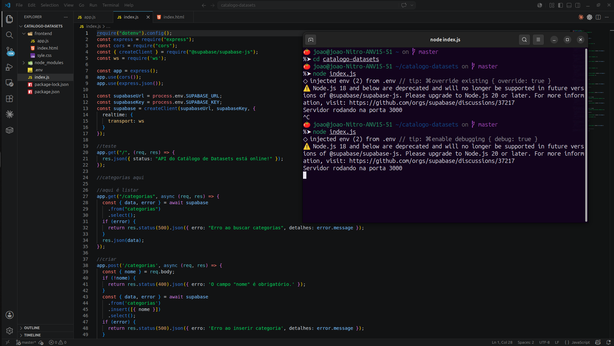
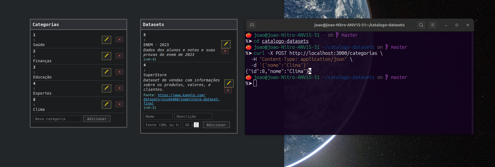
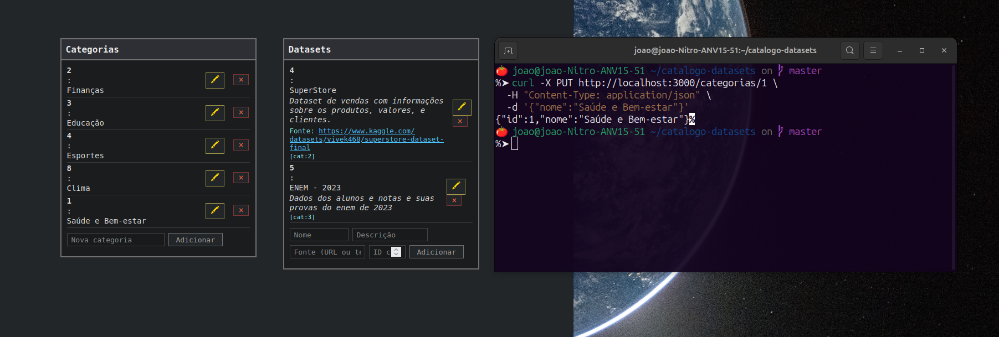
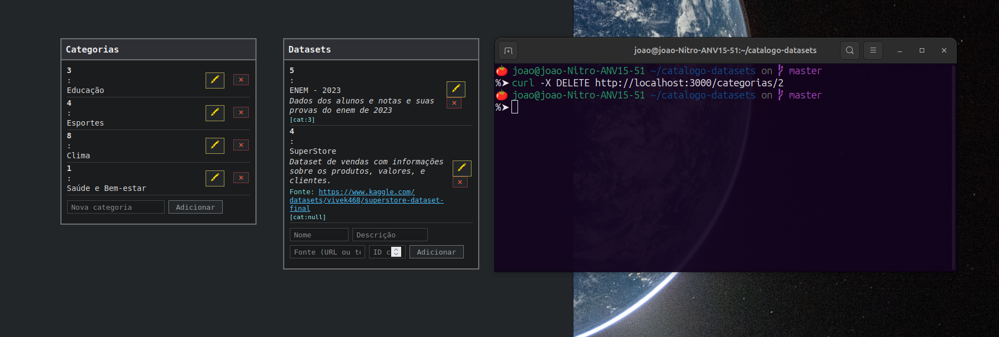
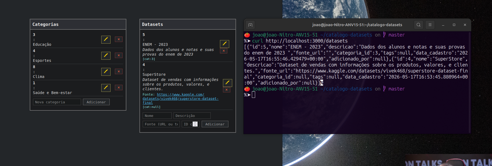
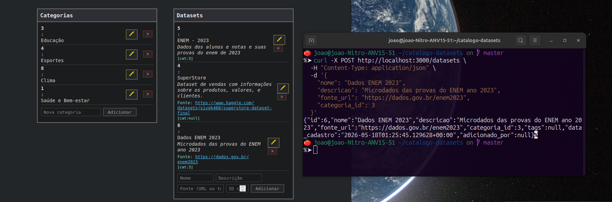
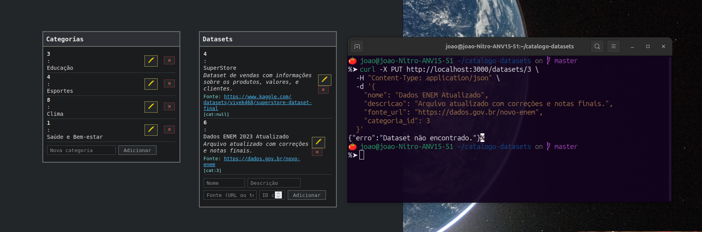
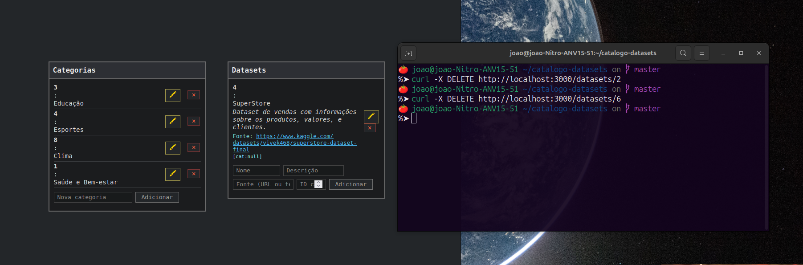

# Catálogo de Datasets

Este projeto é um sistema para cadastro, organização e gerenciamento de conjuntos de dados, permitindo a criação, edição, remoção e visualização de categorias e datasets com visual retrô e backend supabase.

---

## Índice

- [Descrição](#descrição)
- [Tecnologias Utilizadas](#tecnologias-utilizadas)
- [Configuração do Backend (API)](#configuração-do-backend-api)
- [Execução do Frontend](#execução-do-frontend)
- [Endpoints da API](#endpoints-da-api)
- [Estrutura das Tabelas no Supabase](#estrutura-das-tabelas-no-supabase)
- [Funcionalidades](#funcionalidades)
- [Demonstração Visual](#demonstração-visual)

---

## Descrição

O sistema foi criado para facilitar a curadoria e administração de múltiplos conjuntos de dados, agrupando-os por categorias e permitindo edição, exclusão, consulta e atribuição de fonte para cada dataset.  
Conta com uma interface escura, inspirada em aplicativos retrô.

---

## Tecnologias Utilizadas

- Node.js 20+
- Express
- Supabase (PostgreSQL)
- HTML5, CSS3, JavaScript puro

---

## Configuração do Backend (API)

1. Clone o repositório e instale as dependências:

    ```bash
    npm install
    ```

2. Crie um arquivo `.env` na raiz com as seguintes variáveis:

    ```
    SUPABASE_URL=SEU_SUPABASE_URL
    SUPABASE_KEY=SEU_SUPABASE_KEY
    PORT=3000
    ```

3. Execute o backend:

    ```bash
    node index.js
    ```

    Exemplo de servidor rodando:

    

---

## Execução do Frontend

Basta abrir o arquivo `index.html` da pasta do frontend no navegador de sua escolha (Chrome, Firefox, etc).  
O frontend consome a API local automaticamente.

---

## Endpoints da API

- `GET /categorias` – lista todas as categorias
- `POST /categorias` – cria uma nova categoria
- `PUT /categorias/:id` – edita uma categoria
- `DELETE /categorias/:id` – remove uma categoria

- `GET /datasets` – lista todos os datasets
- `POST /datasets` – cria um novo dataset
- `PUT /datasets/:id` – edita um dataset
- `DELETE /datasets/:id` – remove um dataset

Os endpoints recebem e retornam JSON.

---

## Estrutura das Tabelas no Supabase

### Tabela `categorias`

| Campo | Tipo    | Restrição         |
|-------|---------|-------------------|
| id    | serial  | PRIMARY KEY       |
| nome  | text    | NOT NULL          |

### Tabela `datasets`

| Campo        | Tipo    | Restrição                                            |
|--------------|---------|-----------------------------------------------------|
| id           | serial  | PRIMARY KEY                                         |
| nome         | text    | NOT NULL                                            |
| descricao    | text    | NOT NULL                                            |
| fonte_url    | text    | NULLABLE                                            |
| categoria_id | integer | NOT NULL, FOREIGN KEY (categorias(id)), ON DELETE CASCADE |

---

## Funcionalidades

- Adicionar, editar e remover **categorias**
- Adicionar, editar e remover **datasets**
- Visual retrô escuro inspirado em toolboxes
- Inclusão de campo “fonte” para datasets (texto ou URL)
- Relação dataset ↔ categoria

---

## Demonstração Visual

A seguir, prints das operações principais.

### Adicionar uma Categoria



---

### Editar uma Categoria



---

### Remover uma Categoria



---

### Listar Datasets



---

### Adicionar um Dataset



---

### Editar um Dataset



---

### Remover um Dataset



---

## Observações

- Os comandos da API podem ser testados via `curl`, `Postman`, Insomnia ou pelo próprio frontend.
- Certifique-se de rodar o Node.js versão 20 ou superior.
- Modifique ou expanda as funções conforme as necessidades do seu projeto.

---
